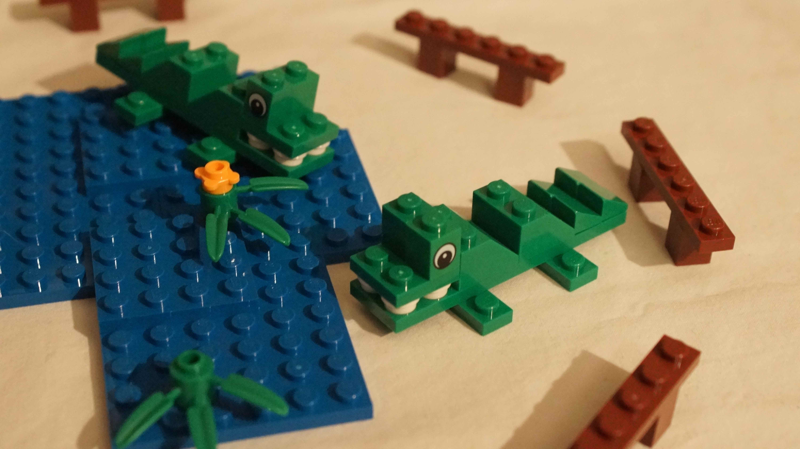
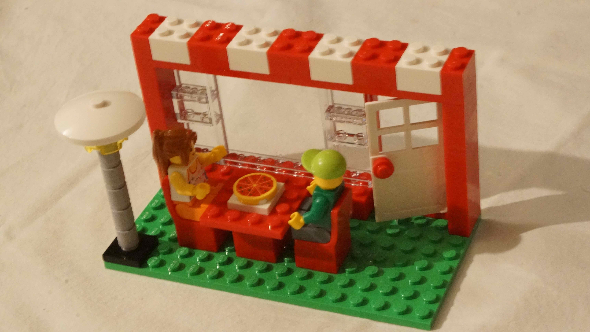
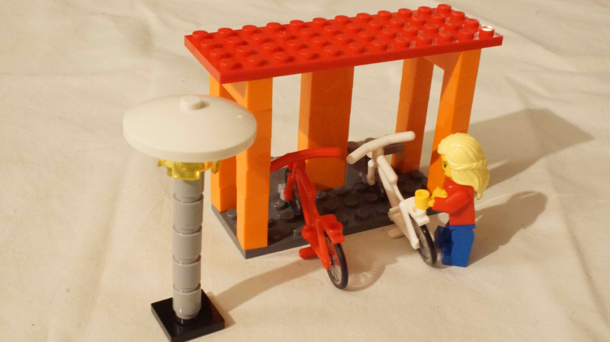

# Gestion de projet agile

Dans l'équipe, nous allons nommer :

- 1 ou 2 représentants des usagers,
- les autres seront les "membres de l'équipe", de manière indifférenciée.

En raison de son expérience de tout à l'heure, chaque membre de l'équipe sera plus ou moins expert dans un domaine.
Mais plutôt que de se cantonner à ce qu'il sait faire, il pourra utiliser son expertise pour conseiller les autres.

On va chercher les usagers (personnages avec leurs accessoires) et on les confie aux représentants des usagers.

Pour chaque récit d'usager (cf. ci-dessous), on essaie de le raconter en "je" et d'identifier une à trois "fonctionnalités" ("je peux X").
Ces fonctionnalités sont inscrites sur des *post-it* et placées dans la première colonne du kanban (`À envisager`).

Les représentants des usagers choisissent les récits (correspondant à peu près à 4 fonctionnalités) qui leur semblent prioritaires du point de vue des usagers et placent les fonctionnalités correspondantes dans la deuxième colonne du kanban (`À faire`), en les triant par priorité de haut en bas.

Les membres de l'équipe déplacent les deux premiers *post-it* dans la troisième colonne (`En cours`).

Une fois que la fonctionnalité est livrée, le *post-it* est déplacée dans la quatrième colonne (`Fait`).

À tout moment, et de manière répétée, les représentants des usagers peuvent demander à ce que leur soit fait une démonstration des fonctionnalités indiquées dans la quatrième colonne.

---

# Annexe : Récits d'usagers (*user stories*)

---

Lorsqu'il n'y a plus aucun post-it dans la deuxième et la troisième colonne (ou prématurément si nécessaire), passer à la séance de [verbalisation](debriefing.md).
