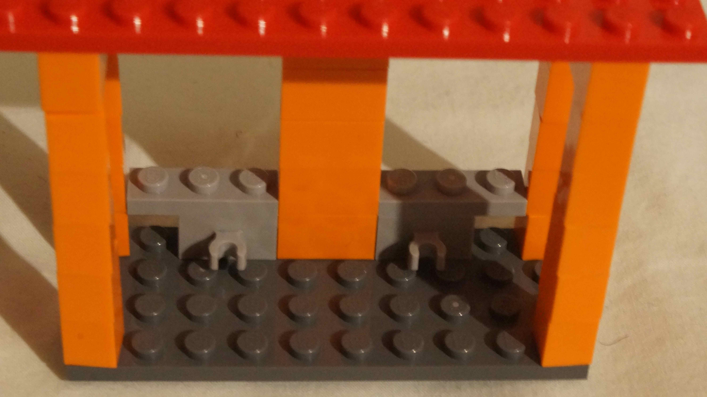

# Gestion de projet classique (GANTT)

## Terrasser le terrain (terrasiers)

## Faire les fondations (maçons)

## Faire le gros œuvre (maçons) 

## (mécaniciens/soudeurs)

## Planter des arbres, arbustes, fleurs (jardiniers)

## Installer les barrières (menuisier)

## Installer les animaux (animaliers)

- dans le parc
  - les canards dans l'étang
- dans le zoo
  - les girafes en liberté à proximité d'un arbre
  - le lion et les crocodiles derrière les barrières

# Fabriquer et installer le mobilier (menuisiers)

- les transats près de la piscine
- la table et les chaises sur la terrasse de la pizzeria

# Fabriquer un bus (mécaniciens)

